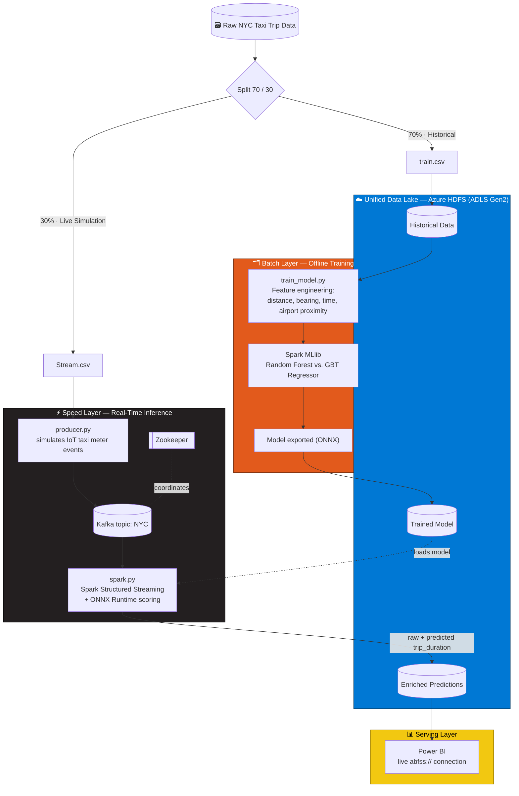

<div align="center">

# 🚕 TaxiStream Intelligence

### Real-Time NYC Taxi Trip Duration Prediction Platform

*A Lambda-Architecture Big Data pipeline combining offline batch training with real-time streaming inference*

**Graduation Project — Group S26-B3-Big Data-G3-E · Faculty of Computers and Artificial Intelligence**

<br/>


</div>

---

## 📖 Table of Contents

- [Overview](#-overview)
- [Architecture & Data Flow](#-architecture--data-flow)
- [Tech Stack](#-tech-stack)
- [Machine Learning Pipeline](#-machine-learning-pipeline--strategy)
- [Requirements](#-functional--non-functional-requirements)
- [Repository Structure](#-repository-structure)
- [Prerequisites](#-prerequisites)
- [Setup & Execution Guide](#-setup--execution-guide-step-by-step)
- [Visualization](#-visualization)
- [Challenges & Mitigation](#-challenges--mitigation-strategies)
- [Team](#-team)

---

## 🔭 Overview

**TaxiStream Intelligence** is an end-to-end Big Data and Machine Learning solution that processes, analyzes, and predicts **New York City taxi trip durations in real time**.

Built on a **Lambda Architecture**, the system handles two data paths at once:

- 🗂️ **Batch Layer** — a historical slice of trip records is processed offline to establish baseline analytics and train a regression model with Apache Spark MLlib.
- ⚡ **Speed Layer** — the remaining trip records are streamed through Apache Kafka to simulate live taxi activity, and scored in real time, in low-latency micro-batches, by Spark Structured Streaming.
- ☁️ **Serving Layer** — both the historical data and the enriched real-time predictions live in a single, unified Azure Data Lake (HDFS-compatible via ADLS Gen2), so Power BI can query one consistent source of truth.

The result is a platform that mirrors how real production data systems separate **fast, disposable local compute** (Kafka, Zookeeper, Spark — all containerized) from **durable, scalable cloud storage** (Azure) — delivering actionable mobility insights through live dashboards comparing **predicted vs. actual trip durations**.

---

## 🏗️ Architecture & Data Flow



*(The team's original workflow diagram is also available at [`Documents/ProjectFlow.jpeg`](Documents/ProjectFlow.jpeg).)*

### Data Flow Summary

| Stage | Description |
|---|---|
| **1. Storage & Batch Foundation** | A 70% historical slice of the dataset is stored in Azure HDFS as the ground-truth baseline used to train and evaluate the model offline, before it's ever exposed to live traffic. |
| **2. Stream Simulation & Ingestion** | `producer.py` reads the remaining 30% row by row and publishes each trip to the Kafka topic `NYC`, simulating a live feed of IoT taxi meter events. Kafka buffers and decouples the producer from the stream processor. |
| **3. Real-Time Processing & Inference** | `spark.py` (Spark Structured Streaming) consumes the Kafka topic, rebuilds the same geospatial and temporal features used in training, and scores each micro-batch with the pre-trained model to predict `trip_duration`. |
| **4. Sink to the Data Lake** | The enriched stream — raw trip data plus the predicted duration — is written back into the same unified Azure HDFS data lake, appended alongside the historical data. |
| **5. Serving & Visualization** | Power BI connects directly to the data lake to render dashboards comparing **predicted vs. actual** trip durations, along with spatial trip patterns and traffic bottlenecks. |

---

## 🧰 Tech Stack

| Category | Tool / Technology | Role in Project |
|---|---|---|
| **Storage & Cloud** |  | Central Data Lake (ADLS Gen2, Hierarchical Namespace) for historical data and enriched streaming results |
| **Data Ingestion** |  | `producer.py` simulates real-time IoT taxi meters, streaming raw trip events sequentially |
| **Message Broker** |   | Buffers high-throughput streaming events with fault-tolerant delivery; Zookeeper coordinates the Kafka broker |
| **Processing & ML** |  | Consumes streams, engineers features, trains the offline model, and runs real-time inference |
| **Model Serving** |  | Trained model is exported to ONNX and scored inside the stream via a fast, portable runtime |
| **Containerization** |  | Runs Zookeeper, Kafka, and a standalone Spark cluster (master + worker) locally, identically on every machine |
| **Visualization** |  | Live dashboards comparing predicted vs. actual trip durations and spatial patterns |

---

## 🧠 Machine Learning Pipeline & Strategy

| Stage | What Happens |
|---|---|
| **1. Feature Extraction** | Spatial features — Haversine distance, bearing, Manhattan distance, and proximity to JFK / LaGuardia airports and Manhattan's center — plus temporal features: pickup hour, month, day of week, weekend and rush-hour flags. |
| **2. Offline Model Training** | Trained with PySpark MLlib on the historical HDFS data. **Random Forest** and **Gradient Boosted Trees (GBT)** regressors are evaluated; the GBT Regressor is selected as the production model, trained on the **log-transformed** trip duration for a more stable fit. |
| **3. Model Serialization** | The trained pipeline is exported to **ONNX** format for fast, lightweight, portable inference at serving time. |
| **4. Streaming Scoring** | `spark.py` loads the ONNX model on startup and scores every incoming Kafka micro-batch via a Spark pandas UDF, converting predictions back out of log-space to yield `predicted_trip_duration_sec`. |

**Evaluation metric:** RMSLE (Root Mean Squared Log Error) — well suited to trip-duration prediction since it penalizes relative error rather than raw seconds, so a 2-minute miss on a 5-minute trip is weighted more heavily than the same miss on a 40-minute trip.

---

## ✅ Functional & Non-Functional Requirements

**Functional**
- Ingest static trip records into Azure HDFS
- Simulate live IoT taxi meter events with a Python producer publishing to Apache Kafka
- Run low-latency micro-batch transformations and real-time scoring with Spark Structured Streaming
- Persist unified, enriched records (inputs + predictions) back to Azure HDFS
- Display operational metrics and predictions through Power BI dashboards

**Non-Functional**

| Requirement | Target |
|---|---|
| ⏱️ **Low Latency** | Inference completes in under 1 second per micro-batch |
| 📈 **Scalability** | Kafka partitions and Spark executors scale horizontally |
| 🛡️ **Fault Tolerance** | Spark checkpointing + Kafka replication prevent data loss |

---

## 📁 Repository Structure

```
Texi-BigData/
├── docker-compose.yml         # Local infra: Zookeeper, Kafka, Spark master + worker
├── producer.py                 # Publishes Stream.csv rows to the Kafka topic "NYC"
├── spark.py                    # Spark Structured Streaming consumer + real-time ONNX inference
├── train_model.py              # Batch job: feature engineering + offline model training
├── saved_lgb_model.onnx        # Exported, production-ready model artifact
├── SparkML.ipynb                # Exploratory model development notebook
├── soort.ipynb                  # Dataset splitting / sorting notebook
├── Documents                    # 📸 Diagrams and dashboard screenshots
└── README.md
```

---

## ✅ Prerequisites

Before you start, make sure you have:

- 🐳 **Docker Desktop** — installed and running ([download here](https://www.docker.com/products/docker-desktop/))
- 🐍 **Python 3.9+** — with `pip` (comes included with Python)
- 🔧 **Git** — to download the project ([download here](https://git-scm.com/downloads))
- ☁️ An **Azure account** with permission to create a **Storage Account**
- 📊 **Power BI Desktop** (Windows) — for the final dashboard step

> New to this stack? No problem. The guide below explains every command, one small step at a time — no prior Docker or Spark experience needed.

---

## 🚀 Setup & Execution Guide (Step by Step)

### Part 1 — Install the tools

1. Install **Docker Desktop** and open it. Wait until it says it's "running" (this is what will host Kafka and Spark for us — no manual installs needed for those).
2. Install **Python 3.9 or newer**. To check it worked, open a terminal (on Windows: search for "Command Prompt" or "PowerShell"; on Mac: search for "Terminal") and type:
   ```bash
   python --version
   ```
   You should see a version number like `Python 3.11.4`.
3. Install **Git**, then check it worked the same way:
   ```bash
   git --version
   ```

### Part 2 — Download the project

In your terminal, go to a folder where you want the project saved, then run:

```bash
git clone https://github.com/Asoussa/Texi-BigData.git
cd Texi-BigData
```

`cd` just means "move into that folder" — every command from now on should be run from inside `Texi-BigData`.

### Part 3 — Install the Python packages this project needs

This project uses a few Python libraries. Install them all with one command:

```bash
pip install pyspark kafka-python onnxruntime pandas numpy
```

- `pyspark` — lets your computer run Spark jobs (and gives you the `spark-submit` command)
- `kafka-python` — lets the producer script talk to Kafka
- `onnxruntime`, `pandas`, `numpy` — used to load and run the trained model

### Part 4 — Prepare your two data files

The scripts expect two CSV files sitting in the project folder, with these **exact names**:

| File name (must match exactly) | Contents |
|---|---|
| `train.csv` | 70% of your raw NYC taxi trip rows (historical data) |
| `Stream.csv` | The remaining 30% of rows (used to simulate live trips) |

Split your raw dataset however you're comfortable (a spreadsheet tool, a small Python/pandas script, or the included `soort.ipynb` notebook all work), then place both files directly inside the `Texi-BigData` folder, next to `producer.py` and `train_model.py`.

> ⚠️ `Stream.csv` has a **capital S** — on some systems, file names are case-sensitive, so typing it exactly matters.

### Part 5 — Set up your Azure cloud storage

1. Go to [portal.azure.com](https://portal.azure.com) and sign in.
2. Click **Create a resource** → search for **Storage account** → **Create**.
3. On the "Advanced" tab, turn **ON** the option called **Hierarchical namespace**. This is what turns regular Azure storage into HDFS-compatible storage (ADLS Gen2) — it's required for this project.
4. Finish creating the storage account (the defaults are fine for everything else).
5. Once it's created, open it, and in the left menu click **Containers** → **+ Container**. Create one named something like `taxi-datalake`.
6. Still in the left menu, click **Access keys**, and copy the **Storage account name** and **Key1** somewhere safe — you'll paste these in Part 8.

### Part 6 — Start the local services with Docker

This one command starts Zookeeper, Kafka, and a two-node Spark cluster (master + worker) for you — you don't need to install any of them by hand:

```bash
docker-compose up -d
```

`-d` means "run in the background" so your terminal stays free. Check everything started correctly:

```bash
docker ps
```

You should see four containers listed: `zookeeper`, `kafka`, `spark-master`, and `spark-worker`. If any is missing, wait 10–15 seconds and run `docker ps` again — some services take a moment to finish starting.

### Part 7 — Train the machine learning model

This step reads `train.csv`, engineers the distance/time/airport features, trains the model, and prints an accuracy score. Run:

```bash
spark-submit train_model.py
```

This can take a few minutes depending on how large `train.csv` is. When it finishes, you'll see a line printed like `--- Model Evaluation: RMSLE = 0.XXXX ---` — lower is better.

### Part 8 — Add your Azure details to the streaming script

Open `spark.py` in any text editor and find these three lines near the top:

```python
STORAGE_ACCOUNT_NAME = "nycdataset1"
STORAGE_ACCOUNT_KEY = "..."
CONTAINER_NAME = "processed-data"
```

Replace the values with the **Storage account name**, **Key1**, and **container name** you saved in Part 5, then save the file.

> 🔒 **Security tip:** committing real storage keys directly into a script — especially in a public GitHub repo — means anyone can read and use them. Once you're comfortable the pipeline works, consider moving these into environment variables instead of leaving them in the source file, and regenerate the key if it's ever been pushed publicly.

### Part 9 — Start the real-time prediction engine

This starts the Spark Structured Streaming job that listens to Kafka and scores incoming trips:

```bash
spark-submit \
  --master local[*] \
  --packages org.apache.spark:spark-sql-kafka-0-10_2.12:3.5.0,org.apache.hadoop:hadoop-azure:3.3.4 \
  spark.py
```

- `--packages` tells Spark to download two small add-ons it needs: one to talk to Kafka, one to talk to Azure storage.
- Leave this terminal window open and running — it will keep listening for new trips.

### Part 10 — Simulate live taxi trips

Open a **second, new terminal window** (keep the one from Part 9 running), move back into the project folder, and run:

```bash
python producer.py
```

This reads `Stream.csv` and sends one trip every 2 seconds to the Kafka topic `NYC` — that deliberate pause is what simulates trips "arriving" in real time, so don't worry if it looks slow.

### Part 11 — Check that it's working

In the terminal running `spark.py` (from Part 9), you should see it processing new micro-batches shortly after `producer.py` starts sending data. To confirm predictions are landing in Azure, go back to the Azure Portal → your storage account → **Containers** → your container → and look for a new `output_data/` folder filling up with files.

### Part 12 — Connect Power BI

1. Open **Power BI Desktop** → **Get Data** → search for **Azure Data Lake Storage Gen2**.
2. Paste in your data lake's URL:
   ```
   https://<your-storage-account-name>.dfs.core.windows.net/<your-container-name>
   ```
3. When prompted, sign in using the same **Key1** from Part 5.
4. Load the `output_data` folder and build visuals comparing the `trip_duration` (actual) and `predicted_trip_duration_sec` (predicted) columns.

---

## 📊 Visualization

Power BI connects directly to the Azure data lake — no separate database in between. Here's the team's actual dashboard:


*(This image is already included in the repo at `Documents/PowerBi.jpeg` — swap it out any time your dashboard changes.)*

---

## ⚠️ Challenges & Mitigation Strategies

| Challenge | Expected Impact | Mitigation Strategy |
|---|---|---|
| **Stream Backpressure** | Traffic spikes cause latency spikes in Spark | Cap incoming micro-batch size with `maxOffsetsPerTrigger` |
| **Model Drift** | Predictions grow stale as traffic patterns evolve | Schedule regular retraining using updated batch logs in Azure HDFS |
| **Cloud I/O Latency** | Frequent small writes slow down HDFS persistence | Compact micro-batches and save output in optimized Parquet format |

---

## 👥 Team

This project was built as a graduation project by:

| Name | GitHub |
|---|---|
| Mustafa Ehab Aql | [@Eng-M0stafaEhab](https://github.com/Eng-M0stafaEhab) |
| Youssef Mohamed Eldwaltly | [@aldwaltly](https://github.com/aldwaltly) |
| Abdallah Mahmoud | [@Asoussa](https://github.com/Asoussa) |
| Mina Maged | [@MinaMaged88](https://github.com/MinaMaged88) |

**Department:** Computer Science / Data Engineering · **Faculty:** Faculty of Computers and Artificial Intelligence
**Domain:** Smart Mobility • Big Data Engineering • Streaming Analytics • Machine Learning

If you found this project useful or interesting, consider ⭐ starring the repo!