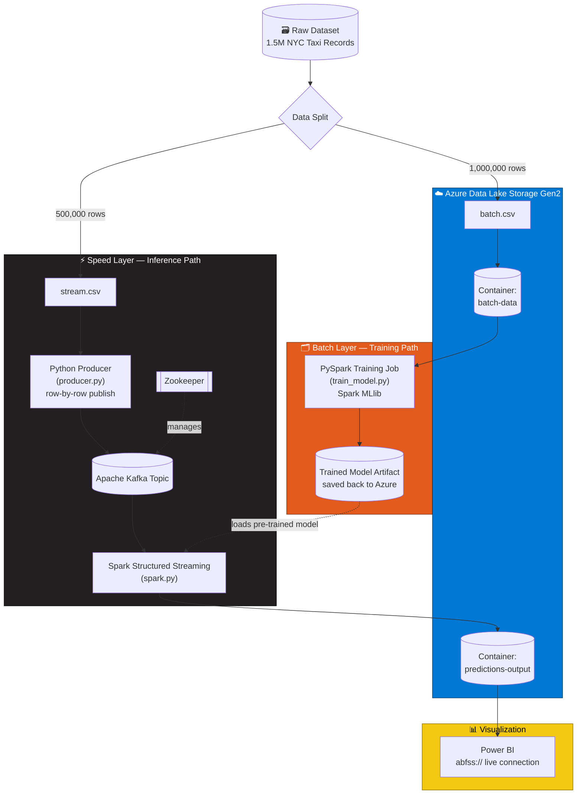
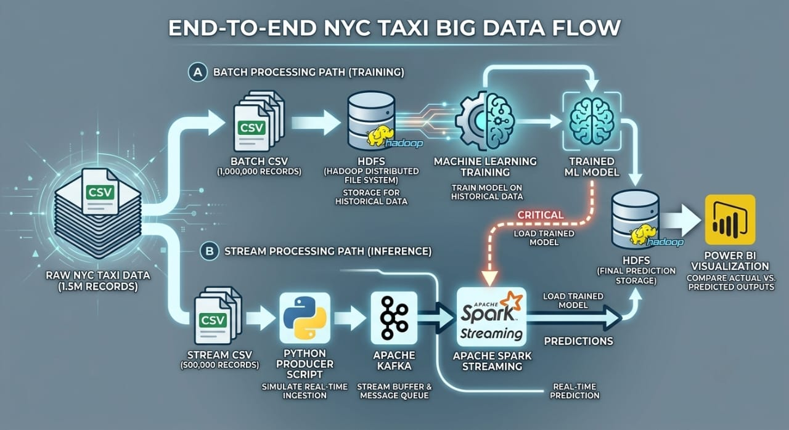
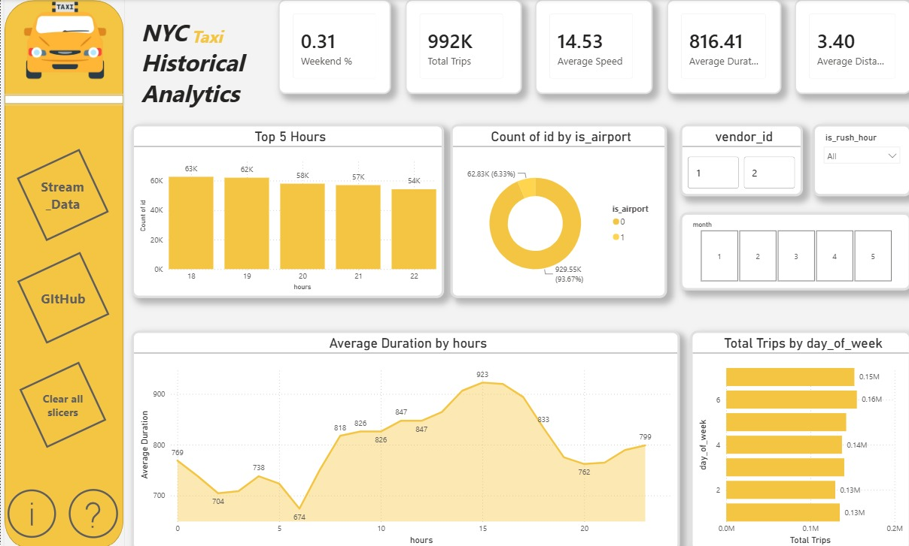

<div align="center">

# 🚕 NYC Taxi Big Data End-to-End Pipeline

### A Lambda-Architecture Data Engineering & Machine Learning System

**Batch Training + Real-Time Streaming Inference on 1.5M NYC Taxi Records**

<br/>


</div>

---

## 📖 Table of Contents

- [Overview](#-overview)
- [Architecture & Data Flow](#-architecture--data-flow)
- [Tech Stack](#-tech-stack)
- [Repository Structure](#-repository-structure)
- [Prerequisites](#-prerequisites)
- [Setup Instructions](#-setup-instructions)
- [Step-by-Step Execution Guide](#-step-by-step-execution-guide)
- [Visualization](#-visualization)
- [Author](#-author)

---

## 🔭 Overview

This project implements a **production-style Lambda Architecture** for processing and modeling **1.5 million NYC Taxi trip records**, combining historical batch training with live streaming inference.

It is designed to demonstrate real-world Big Data engineering patterns:

- 🗂️ **Batch Layer** — large-scale historical data is used to train a machine learning model offline using Apache Spark MLlib.
- ⚡ **Speed Layer** — new records are simulated in real time through Apache Kafka and scored on-the-fly by a Spark Structured Streaming job using the pre-trained model.
- ☁️ **Serving Layer** — all raw data, trained model artifacts, and prediction outputs are persisted in **Azure Data Lake Storage Gen2**, decoupling storage from compute entirely.
- 📊 **Presentation Layer** — Power BI connects directly to the data lake to visualize actual vs. predicted values in near real time.

The result is an architecture that mirrors how modern data platforms separate **cheap, containerized local compute** from **durable, scalable cloud storage** — a pattern widely used in industry-grade data platforms.

---

## 🏗️ Architecture & Data Flow





### Data Flow Summary

| Stage | Description |
|---|---|
| **1. Data Splitting** | The raw 1.5M-record dataset is split into `batch.csv` (1,000,000 rows) for training and `stream.csv` (500,000 rows) for live simulation. |
| **2. Batch Ingestion** | `batch.csv` is uploaded to the `batch-data` container in ADLS Gen2. |
| **3. Model Training** | A PySpark job (`train_model.py`) reads the batch data from Azure, trains an ML model with Spark MLlib, and writes the model artifact back to Azure. |
| **4. Stream Simulation** | `producer.py` reads `stream.csv` row by row and publishes each record to a Kafka topic, simulating a live taxi-trip event feed. |
| **5. Real-Time Inference** | A Spark Structured Streaming application (`spark.py`) consumes the Kafka topic, loads the pre-trained model from Azure, and scores each incoming record in real time. |
| **6. Output Persistence** | Predictions (actual + predicted values) are written back to the `predictions-output` container in ADLS Gen2 via the `abfss://` protocol. |
| **7. Visualization** | Power BI connects directly to the ADLS Gen2 endpoint to render live dashboards comparing actual vs. predicted fare/trip values. |

---

## 🧰 Tech Stack

| Layer | Technology | Purpose |
|---|---|---|
| **Processing & ML** |   | Batch training and distributed processing |
| **Stream Processing** |  | Real-time consumption of Kafka events and inference |
| **Message Broker** |   | Real-time event ingestion and topic coordination |
| **Cloud Storage** |  | HDFS-compatible hierarchical cloud storage for raw data, models, and predictions |
| **Containerization** |   | Local orchestration of Kafka, Zookeeper, and Spark |
| **Language** |  | Producer scripts and PySpark job logic |
| **Visualization** |  | Live dashboards for actual vs. predicted trip values |

---

## 📁 Repository Structure

```
Texi-BigData/
├── docker-compose.yml       # Local orchestration: Kafka, Zookeeper, Spark
├── producer.py               # Publishes stream.csv rows to Kafka topic
├── spark.py                  # Spark Structured Streaming consumer + real-time inference
├── train_model.py            # Batch PySpark job — trains the ML model on ADLS Gen2 data
├── train_model/               # Training pipeline resources/artifacts
├── SparkML.ipynb             # Exploratory notebook for model development
├── saved_lgb_model.onnx      # Exported trained model artifact
├── requirements.txt          # Python dependencies
├── docs/                       # 📸 Add architecture & dashboard screenshots here
└── README.md
```

---

## ✅ Prerequisites

Before running this project, make sure you have:

- 🐳 **Docker & Docker Compose** installed and running
- 🐍 **Python 3.9+** with `pip`
- ☁️ An **Azure Subscription** with a **Storage Account** configured for **ADLS Gen2** (Hierarchical Namespace **enabled**)
- 🔑 Your **Storage Account Name** and **Access Key** (Access keys → key1, under the storage account's "Security + networking" blade)
- ✨ **Apache Spark 3.x** binaries available locally (or via the Dockerized Spark image) with `spark-submit` on your `PATH`
- 📊 **Power BI Desktop** (Windows) for the final visualization step

---

## ⚙️ Setup Instructions

### 1️⃣ Clone the Repository

```bash
git clone https://github.com/Asoussa/Texi-BigData.git
cd Texi-BigData
```

### 2️⃣ Install Python Dependencies

```bash
python -m venv venv
source venv/bin/activate      # On Windows: venv\Scripts\activate
pip install -r requirements.txt
```

### 3️⃣ Provision Azure Data Lake Storage Gen2

1. Create a **Storage Account** in the Azure Portal with **Hierarchical Namespace = Enabled**.
2. Create two containers:
   - `batch-data`
   - `predictions-output`
3. Upload `batch.csv` to the `batch-data` container.
4. Copy the **Storage Account Key** — it will be passed into Spark's Hadoop configuration in the execution steps below.

### 4️⃣ Split the Raw Dataset

If not already split, divide the raw 1.5M-record NYC Taxi dataset:

```bash
python split_dataset.py \
  --input nyc_taxi_raw.csv \
  --batch-output batch.csv \
  --stream-output stream.csv \
  --batch-size 1000000 \
  --stream-size 500000
```

> `batch.csv` → upload to Azure (`batch-data`) · `stream.csv` → keep locally for the Kafka producer.

### 5️⃣ Spin Up Local Infrastructure (Docker)

```bash
docker-compose up -d
```

Verify all containers (Zookeeper, Kafka, Spark) are healthy:

```bash
docker ps
```

Create the Kafka topic used for streaming ingestion:

```bash
docker exec -it kafka kafka-topics.sh --create \
  --topic nyc-taxi-stream \
  --bootstrap-server localhost:9092 \
  --partitions 1 \
  --replication-factor 1
```

---

## 🚀 Step-by-Step Execution Guide

### Step 1 — Train the Batch Model

Runs a Spark job that reads `batch.csv` from ADLS Gen2, trains the model with Spark MLlib, and writes the artifact back to Azure.

```bash
spark-submit \
  --packages org.apache.hadoop:hadoop-azure:3.3.4,com.microsoft.azure:azure-storage:8.6.6 \
  --conf spark.hadoop.fs.azure.account.key.<STORAGE_ACCOUNT_NAME>.dfs.core.windows.net=<STORAGE_ACCOUNT_KEY> \
  train_model.py \
  --input abfss://batch-data@<STORAGE_ACCOUNT_NAME>.dfs.core.windows.net/batch.csv \
  --model-output abfss://batch-data@<STORAGE_ACCOUNT_NAME>.dfs.core.windows.net/models/taxi_model
```

### Step 2 — Start the Kafka Producer

Streams `stream.csv` row by row into the Kafka topic, simulating live taxi trip events.

```bash
python producer.py \
  --input stream.csv \
  --topic nyc-taxi-stream \
  --bootstrap-server localhost:9092
```

### Step 3 — Run the Spark Streaming Inference Job

Consumes the Kafka topic in real time, loads the pre-trained model from Azure, scores incoming records, and writes predictions back to ADLS Gen2.

```bash
spark-submit \
  --packages org.apache.spark:spark-sql-kafka-0-10_2.12:3.4.1,org.apache.hadoop:hadoop-azure:3.3.4,com.microsoft.azure:azure-storage:8.6.6 \
  --conf spark.hadoop.fs.azure.account.key.<STORAGE_ACCOUNT_NAME>.dfs.core.windows.net=<STORAGE_ACCOUNT_KEY> \
  spark.py \
  --kafka-bootstrap-server localhost:9092 \
  --kafka-topic nyc-taxi-stream \
  --model-path abfss://batch-data@<STORAGE_ACCOUNT_NAME>.dfs.core.windows.net/models/taxi_model \
  --output abfss://predictions-output@<STORAGE_ACCOUNT_NAME>.dfs.core.windows.net/live-predictions
```

### Step 4 — Verify the Output

Check that predictions are landing in the `predictions-output` container via the Azure Portal, Azure Storage Explorer, or the CLI:

```bash
az storage fs file list \
  --account-name <STORAGE_ACCOUNT_NAME> \
  --file-system predictions-output \
  --path live-predictions
```

---

## 📊 Visualization

Power BI connects **directly** to the ADLS Gen2 endpoint (no intermediate database required):

1. Open **Power BI Desktop** → **Get Data** → **Azure** → **Azure Data Lake Storage Gen2**.
2. Enter the endpoint URL:
   ```
   https://<STORAGE_ACCOUNT_NAME>.dfs.core.windows.net/predictions-output
   ```
3. Authenticate using the **Storage Account Key**.
4. Load the `live-predictions` data and build visuals comparing **actual vs. predicted** trip values — e.g., fare amount, trip duration, or distance.
5. Set an appropriate **refresh schedule** to keep the dashboard current as new predictions arrive.



---

## 👤 Authors

**Abdallah Mohamed**, **Mostafa Ehab**, **Youssef ElDwaltly**, **Mina Maged**

If you found this project useful or interesting, consider ⭐ starring the repo!